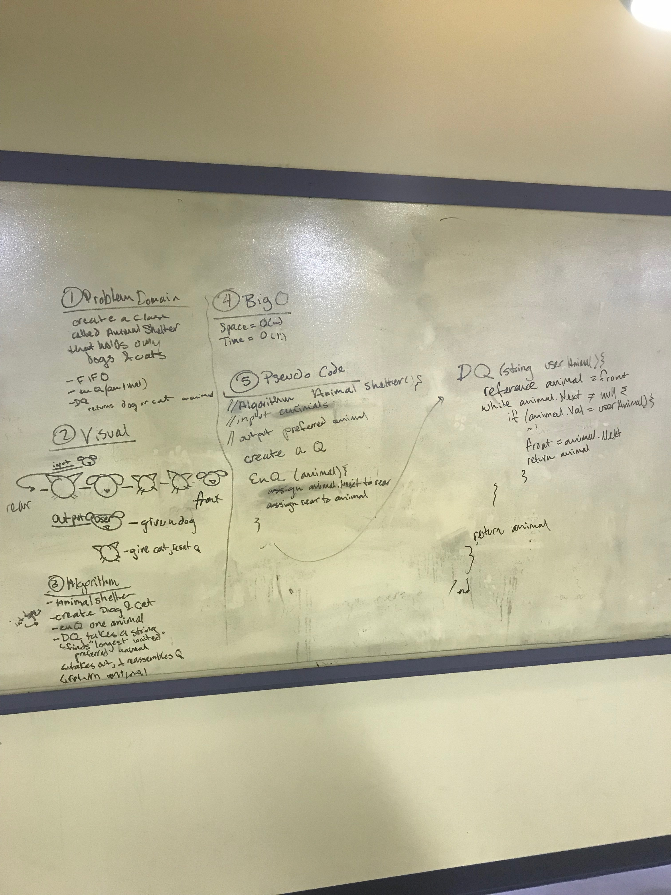

## Create a First In, First Out Animal Shelter
## Challenge
Create a class called AnimalShelter which only can hold dogs and cats. This shelter operates using a First-In,First-Out approach.

Implement enqueue(animal) that adds an animal to the shelter. This animal can be either a cat or dog object.

Implement dequeue(pref) that will return either a dog or a cat. If pref, a string is a cat, return the longest waiting cat, if dog, return the longest waiting dog.

* Unit Tests are included

***
## Solution
