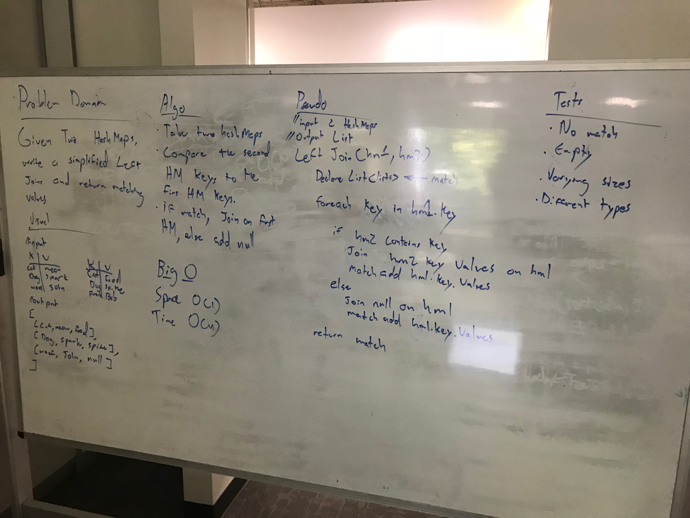

## Left Joins on two Hash Maps
## Challenge

Given two Hash Maps, perform a simplified left joins on matching key values. If there wasn't a key match, return a form of null at the end of the join.

Input: 
HashMap 1
* at, check
* bad, thing
* dark, blue
* yellow, frank

HashMap 2
* at, boing
* red, thing
* dark, bright
* yellow, doodad

Output
* at, check, boing
* bad, thing, null
* dark, blue, bright
* yellow, frank, doodad

* Unit Tests are included

***
## Solution

