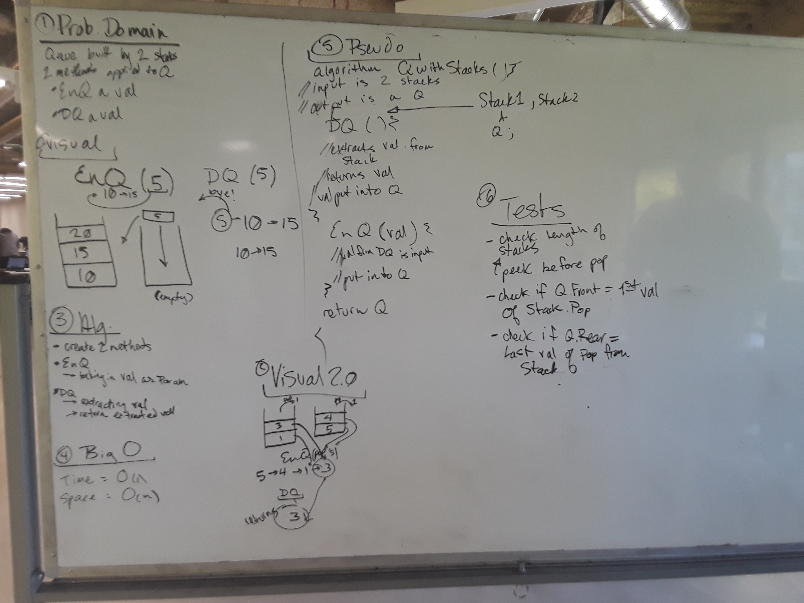

## Implement a Queue using Two Stacks
## Challenge

Given two stacks, write an Enqueue and a Dequeue method that simulates First In, First Out principles and implement a Queue Class with these.

* Enqueue
`Input:` [5]->[10]->[15] `Arg` 2 `Output:` [2]->[5]->[10]->[15]
* Dequeue
`Input:` [5]->[10]->[15] `Output:` [5]->[10]

* Unit Tests are included

***
## Solution
