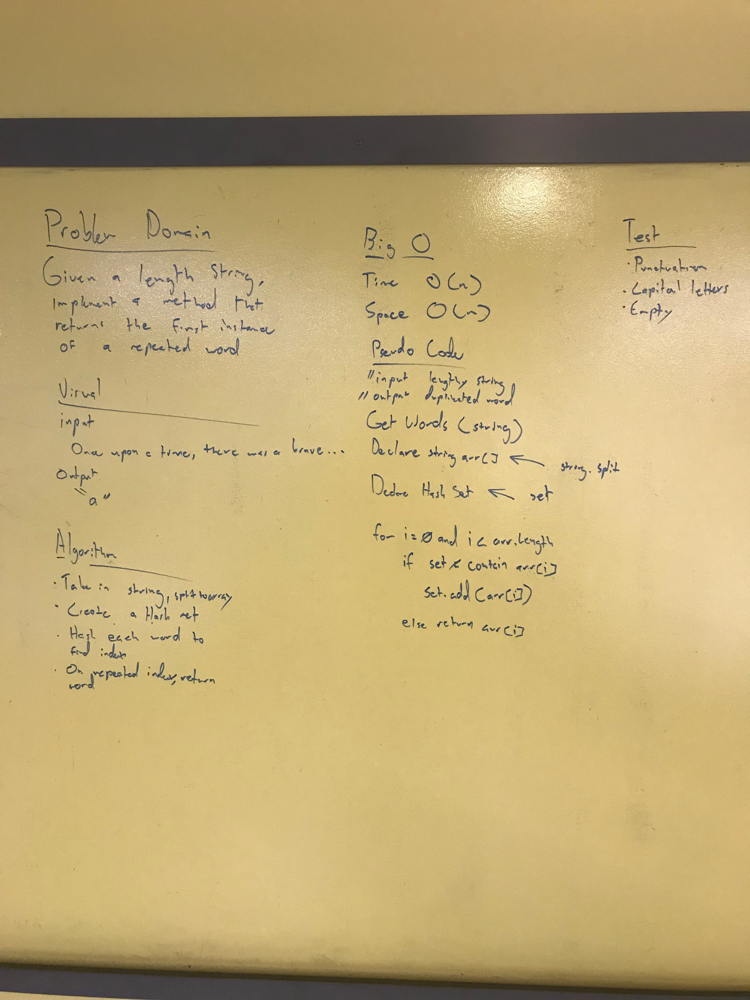

# Find the first instance of a repeated word

## Challenge
Given a lengthy string, write a method that finds the first instance of a duplicated word without using any built in parameters.

unit tests are provided
***
## Solution
