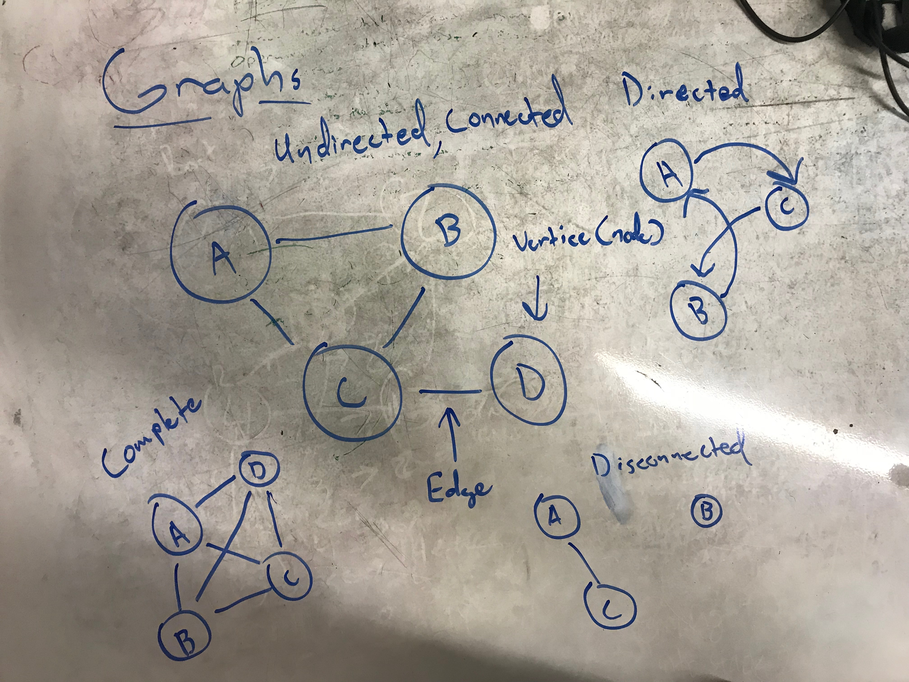

# Implement A Graph
A graph is a collection of data points that can be non-linear that is made up of vertices (or nodes) and potentially can be connected with segments known as an Edge.

Common Terminology with graphs:
- Vertices - (also node) is a data object that can have zero or many adjacent elements
- Edge - segment between two vertices
- Neighbor - nodes that are located next to the given vertice
- Degree - the number of edges connected to a vertex

This implementation is an example of an undirected graph which is a graph that does not move in a specific direction or is bi-directional.

### Uses
1. Useful for GPS as this data structure is similar to coordinates and can mock that interaction
2. Social Media platforms very much use graphs to connect and interact with the users and data

## Challenge
Implement a graph with the following:

* AddEdge() - Adds a new vertice to the graph
* GetNodes() - returns all the nodes of the graph as a collection
* GetNeighbors() - returns a collection of nodes connected to given node 
* Size() - returns the total number of nodes in the graph
* BreadthFirst() - Takes root node and returns collection of of all nodes in visited order

Unit tests are provided with this challenge
***
## Visual

