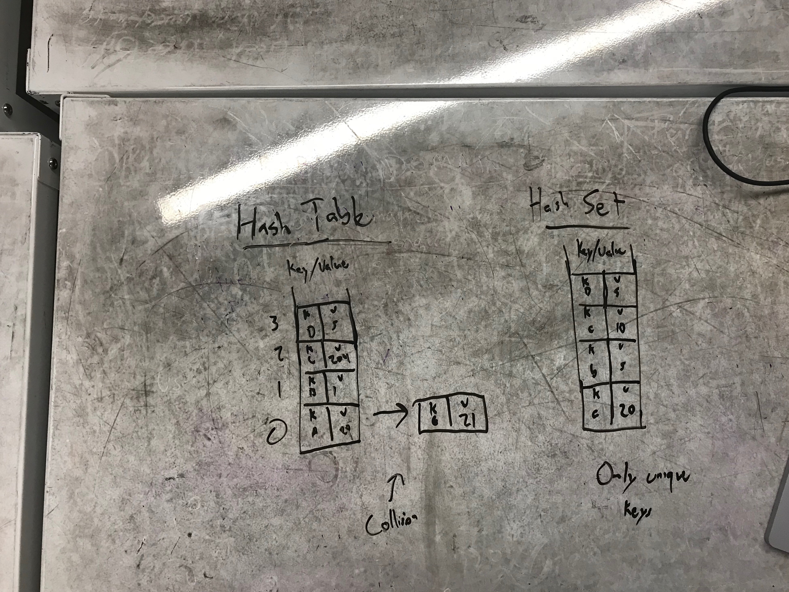

# Implement A Hash Table
A Hash table is an array of fixed sized that contains key/value pairs at a given index. This index is determined via a hashing algorithm.

Common Terminology with graphs:
- Table - An array of fixed sized
- Bucket - A key/value pair that is at an index of the table
- Collision - What happens when two different keys hash to the same index

This implementation of a Hash Table deals with collisions by modeling a linked list system. 

### Uses
1. Useful for Caches. Helps speed up access to data in slower media 
2. Also useful for sets and determining whether or not a specific k/v pair exists (Records or a library of books for example)

## Challenge
Implement a HashTable with the following:

* Add(key,value) - void return
* Find(key) - returns the value associated with key
* ContainsKey(key) - returns a bool
* GetHash(key) - Method for the hashing algorithm

Add stretch goal:

Implement a HashSet - No collisions are allowed
  
Unit tests are provided with this challenge
***
## Visual

