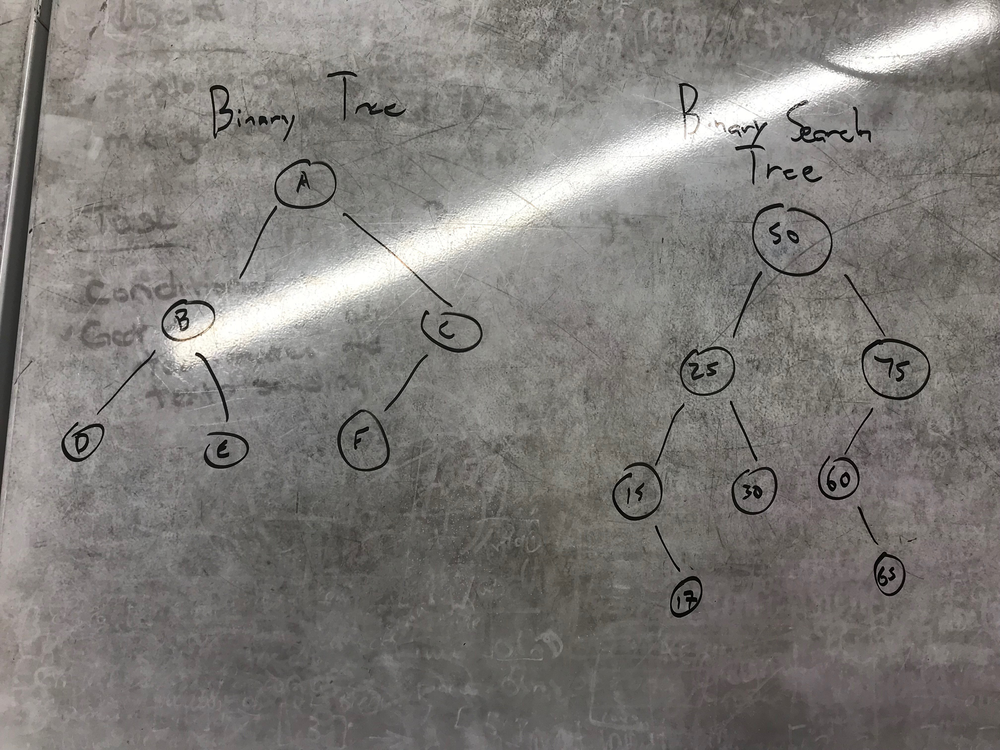

# Implement A Binary Tree and a Binary Search Tree
A binary tree (BT) is a data structure that each node within the tree has no more than two children, a Left Childe and a Right Child. 

A binary search tree (BST) implements a binary tree but also sorts the incoming values based on being less than or greater than the parent node value.

### Uses
1. Since Binary Tree itself is rather the family of this kind of data structure, they are used to build other tree implementations such as Binary Search Trees.
2. Binary Search Trees are useful for the storage of changing data but is organized in a specific manner
3. Used in determining polygons and space rendering in game development

## Challenge
After learning about BT and BST, implement the following functionality

In your Binary Tree Class and Binary Search Tree Class
* PreOrder()
* InOrder()
* PostOrder()
* BreadthFirst()

Also in your Binary Tree
* Search()

Also in your Binary Search Tree
* Search()
* Add a Node()

There consist a BinaryTree class and BinarySearchTree class that inherits functionality from the BinaryTree class

Unit tests are provided with this challenge
***
## Visual

