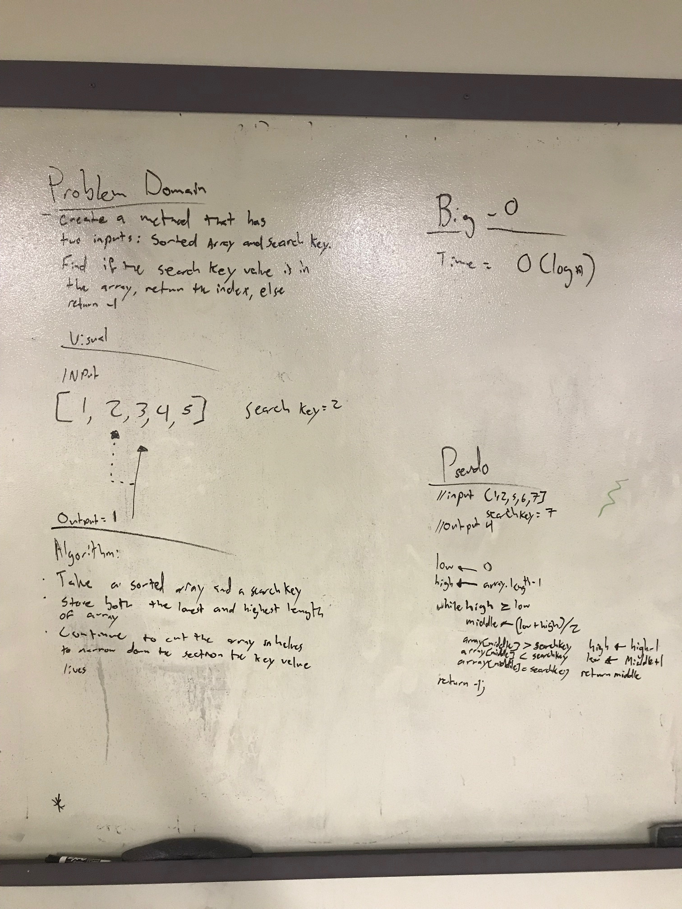

# Binary Search

## Challenge
Build a binary search method that searches a given array with a search key. If the search key matches a value within the array, return it's index otherwise return a -1 if no match is found.
* Not using built in Array methods
***
## Solution
