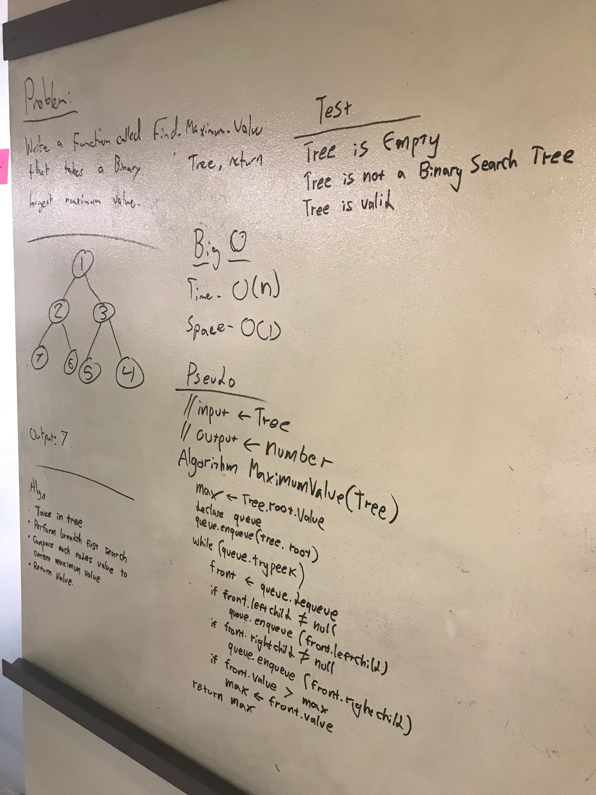

## Find the maximum value in a Binary Tree
## Challenge
Write a method which takes in a binary tree as your only argument. Traverse and return the maximum value that is stored within the tree and you can assume that the values are numeric.

* Unit Tests are included

***
## Solution
