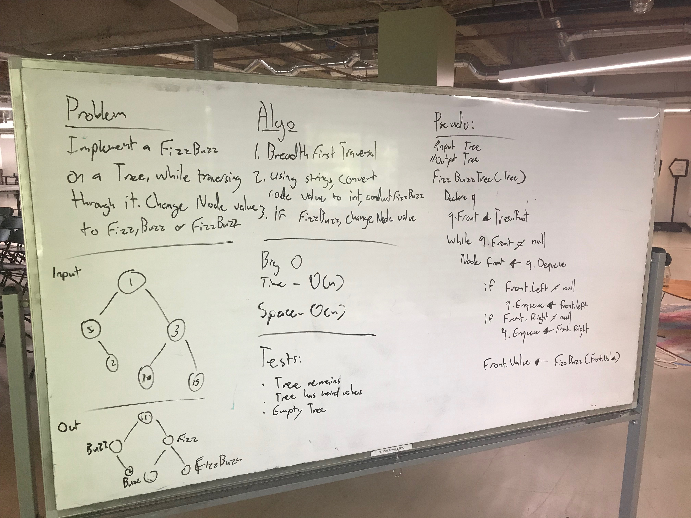

# Conduct FizzBuzz on a tree while traversing it and change its values

## Challenge
Write a method that implements FizzBuzz on a given tree. Determine whether or not a value in a node is divisible by 3,5,or both and change the value of that node to the correct Fizz, Buzz or FizzBuzz.

* No built-in methods

***
## Solution
