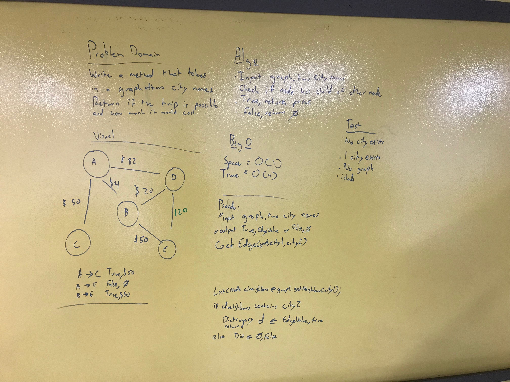

## Is a Flight Path a Possible Direct Route
## Challenge
Create a method that takes in a graph and array of cities. If the path is possible only through direct routes, return an object that has a True and the total calculated edge values else return an object that has a False and a cost of 0

* Unit Tests are included

***
## Solution
