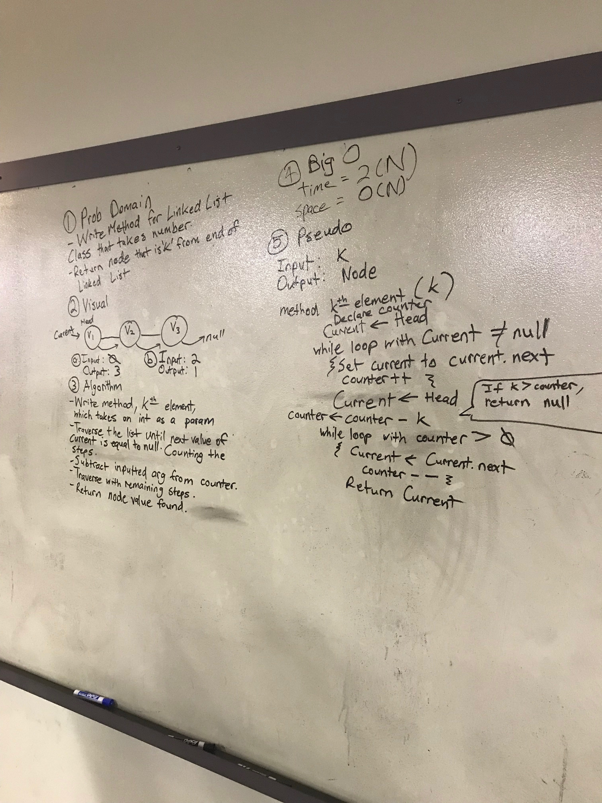

## Find KthElement of a Node from the end of a Linked List
## Challenge

Write a method for the Linked List Class which takes a number k, as a parameter. Return the
node that is k from the end of the linked list. 

`Input:`head->[1]->[3]->[8]->[2]->X `Args:`k = 0 `Output:` [2]->

`Input:`head->[1]->[3]->[8]->[2]->X `Args:`k = 2 `Output:` [3]->

`Input:`head->[1]->[3]->[8]->[2]->X `Args:`k = 6 `Output:` Exception

* Unit Tests for the new Linked List Class method are included

***
## Solution
