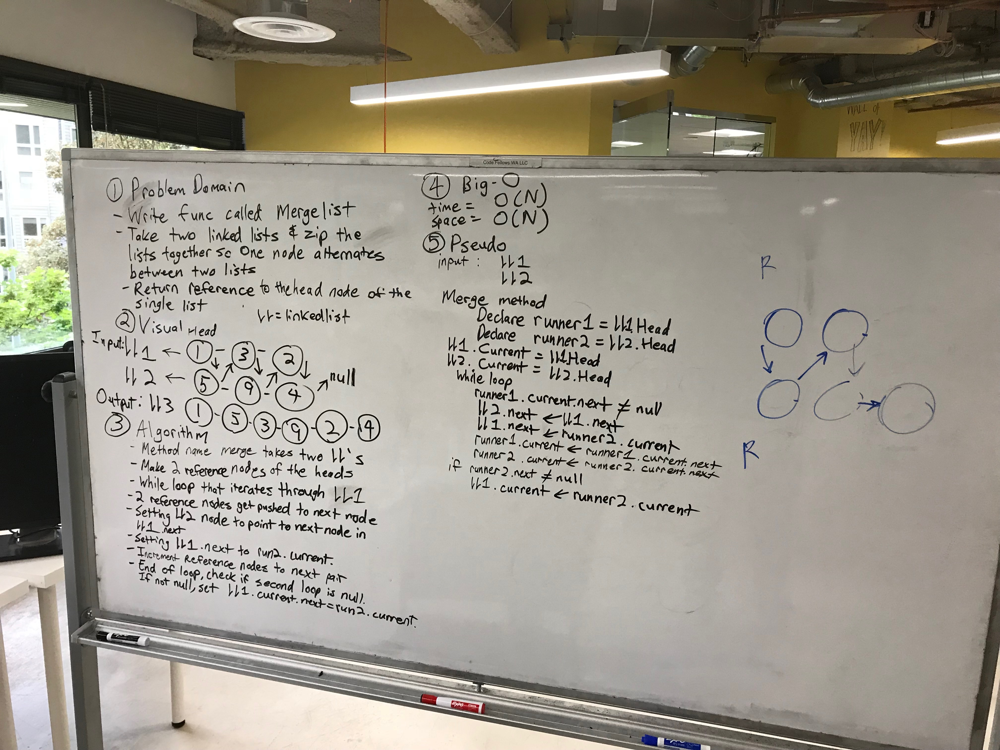

## Merge Two Lists into a Single New List
## Challenge

Write a method that takes two Linked Lists as parameters. Have them merge in a Zip-like pattern and return the newly merged Linked List.

`Input:`head->[1]->[3]->[5]->X 

`Input:`head->[2]->[4]->[6]->[8]->X 

`Output:`head->[1]->[2]->[3]->[4]->[5]->[6]->[8]->X

* Unit Tests are included

***
## Solution
