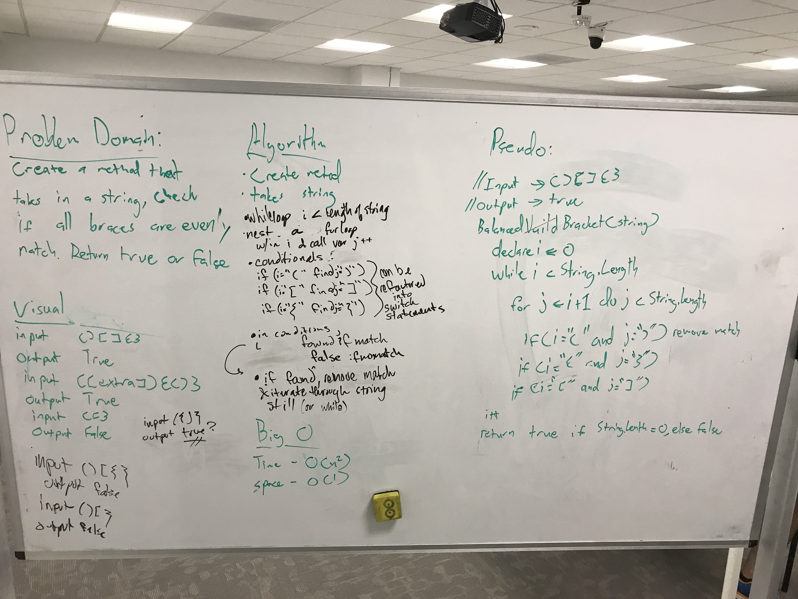

## Multi-Bracket Validation
## Challenge

Write a method that only takes in a string as an argument, and should return a boolean
representing whether or not the brackets in the string are balanced. There are
three types of brackets:

* `{}`
* `[]`
* `()`

#### Examples

* Input: `{}` Output: True
* Input: `{}()[]` Output: True
* Input: `{[]}(Other){characters}` Output: True
* Input: `{(})` Output: False
* Input: `{([)}]` Output: False
* Input: `)` Output: False

* Unit Tests are included

***
## Solution

