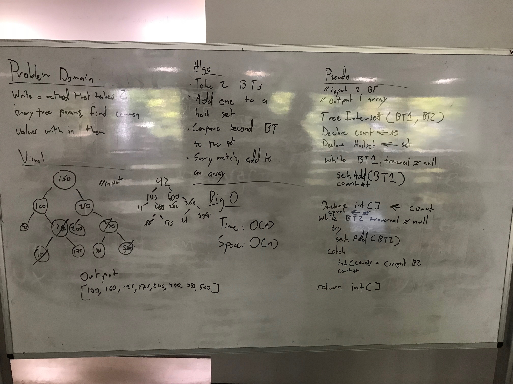

# Find repeated values in two Binary Trees

## Challenge
Given two binary trees, traverse and find all the common values within each the trees.

My solution is for if the trees are not guaranteed to be of the same length.

unit tests are provided
***
## Solution
