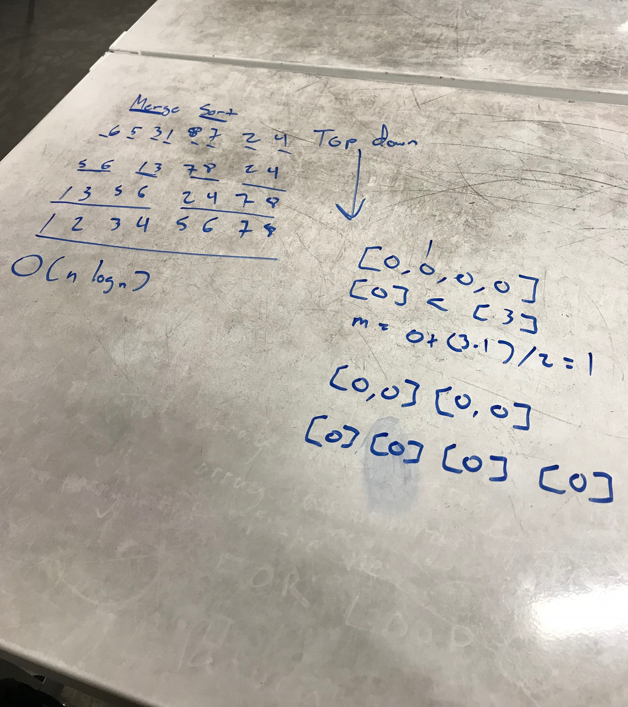

## Implement a Merge Sort Algorithm

### What is it?
Merge sort is a comparison based sorting algorithm. This follows a divide and conquer approach as the incoming array is divided into smaller subsets until it reaches individual pieces.

After, begin the comparison process and merging the subsets into each other until one array is merged together. 

This project contains unit tests.

### Visual
