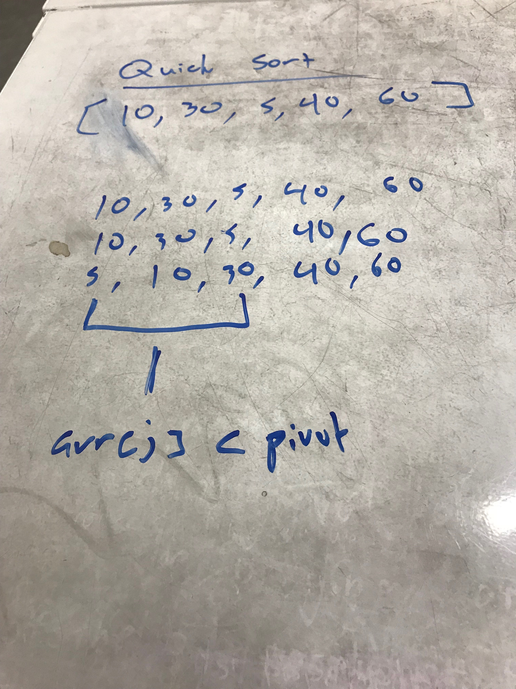

## Implement a Quick Sort Algorithm

### What is it?
Quick sort is a comparison based sorting algorithm. This follows a divide and conquer approach with a pviot being designated in the array and that pivot is used as our "comparator." As it iterates through the array, it will swap values based on this pivot until the array is sorted

This project contains unit tests.

### Visual
